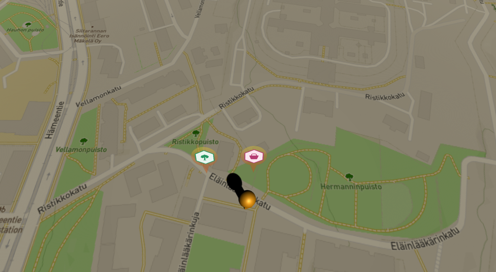
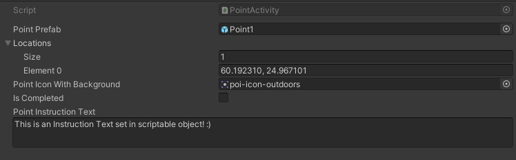
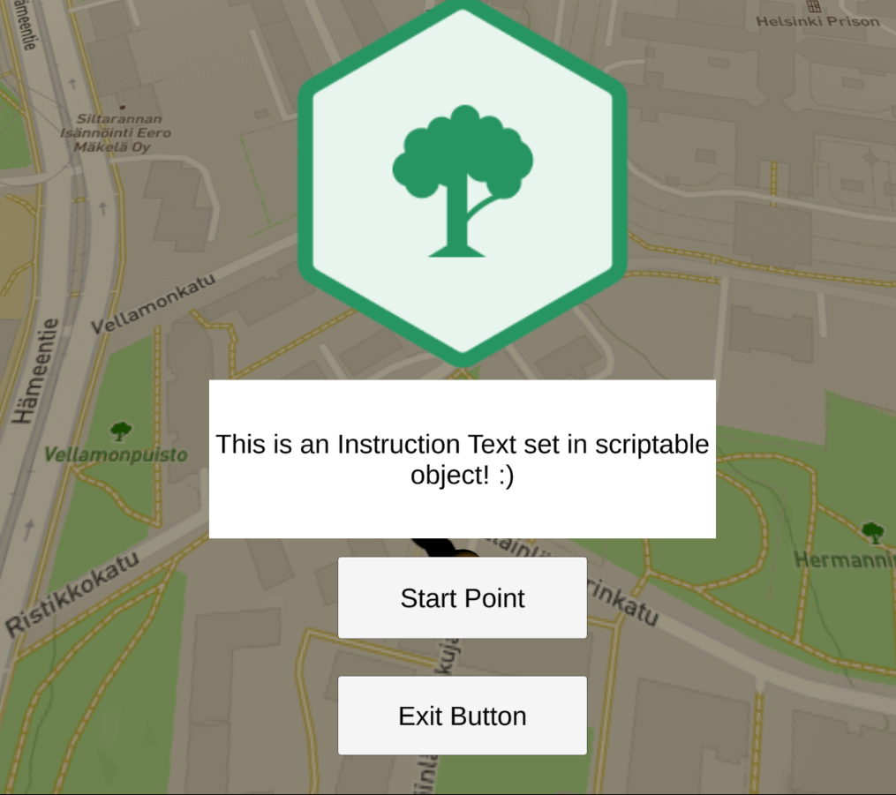
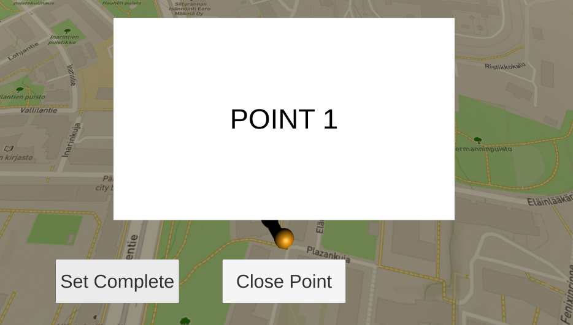

# Point Activity System

Point activity system is a plugin that works on top of Unity Mapbox API.
With it you can create Pokemon GO -style points that are displayed on top of Mapbox's map.

Point Activity System uses scriptable objects as base. 

Each point needs to have map coordinates, icon to display and prefab that is loaded when point is activated.

When user activates the point, UI prompt is shown where it's possible to continue without opening the point.

Currently Point Activity System is designed to open an UI view when point is activated but basically it should be able to do almost anything, since all point functionality can be modified or overridden easily.

I have used this system to take pictures with phone camera, to show 360-images,  animations and complex 3D-models as points and also built simple quiz system that marks the point completed when user answers correctly to a quiz.

